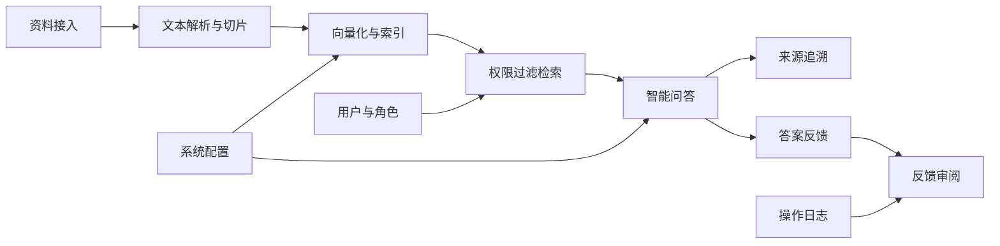
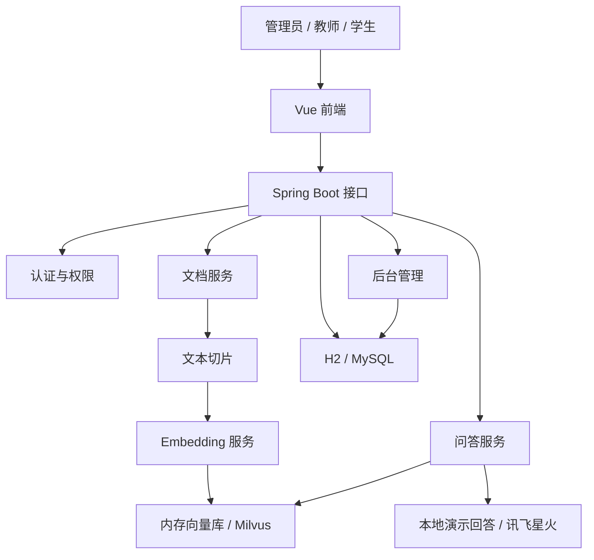

# 校园知识库问答系统

> 毕设、论文和系统架构图可以配合使用：[毕业论文画图助手](https://gitee.com/chenmin_1_2857135639/bishelunwen)，也可以直接在线使用：[https://bishe.jf3q.com](https://bishe.jf3q.com)。

主包是 02 年的，15 岁开始学习计算机，17 岁入行。虽然没有上过大学，但已经帮助很多人顺利毕业和就业。开源这些项目，希望能帮到你们，也顺便推荐我的论文 AI 工具。对主包感兴趣可以在抖音搜索：迷人间；想学习 AI 编程或需要辅导，也可以联系主包。

这是一个面向校园规章、办事流程、教学资料和学生服务的知识库问答系统。系统提供资料接入、文本切片、向量检索、智能问答、来源追溯、反馈审阅、用户权限和操作日志，适合作为课程设计、毕业设计、校园知识服务原型或后台管理系统二次开发基础。

## 演示材料

- 演示视频：[docs/campus-rag-demo.mp4](docs/campus-rag-demo.mp4)
- 抽帧预览：[docs/campus-rag-demo-contact-sheet.png](docs/campus-rag-demo-contact-sheet.png)
- 页面截图目录：[docs/screenshots](docs/screenshots)

| 页面 | 截图 |
| --- | --- |
| 登录页 | [01-login.png](docs/screenshots/01-login.png) |
| 工作台 | [02-dashboard.png](docs/screenshots/02-dashboard.png) |
| 智能问答 | [03-chat.png](docs/screenshots/03-chat.png) |
| 文档管理 | [04-knowledge.png](docs/screenshots/04-knowledge.png) |
| 资料录入 | [05-create.png](docs/screenshots/05-create.png) |
| 系统配置 | [06-settings.png](docs/screenshots/06-settings.png) |
| 用户管理 | [07-users.png](docs/screenshots/07-users.png) |
| 操作日志 | [08-logs.png](docs/screenshots/08-logs.png) |
| 问答反馈 | [09-feedback.png](docs/screenshots/09-feedback.png) |

## 功能模块



## 系统架构



## 技术栈

- 后端：Spring Boot 3、Spring Data JPA、H2、MySQL、Apache Tika、Milvus Java SDK
- 前端：Vue 3、Vite、Pinia、Vue Router、Element Plus、ECharts
- 问答：本地演示回答、可选讯飞星火 HTTP 兼容接口
- 向量检索：默认内存向量库，可切换 Milvus
- 演示视频：Remotion

## 本地运行

后端默认使用 H2 和内存向量库，可以直接演示。

```powershell
cd backend
mvn spring-boot:run "-Dspring-boot.run.profiles=local"
```

```powershell
cd frontend
npm install
npm run dev
```

如果本机 `8080` 或 `5173` 已被占用，可以换端口运行：

```powershell
cd backend
mvn spring-boot:run "-Dspring-boot.run.profiles=local" "-Dspring-boot.run.arguments=--server.port=18080"
```

```powershell
cd frontend
$env:VITE_BACKEND_TARGET="http://localhost:18080"
npm run dev -- --port 5180
```

默认演示账号：

| 账号 | 密码 | 角色 |
| --- | --- | --- |
| `admin` | `123456` | 系统管理员 |
| `teacher` | `123456` | 教师 |
| `student` | `123456` | 学生 |
| `dept` | `123456` | 部门管理员 |

## 生产依赖服务

需要 MySQL 和 Milvus 时，可以先启动基础服务：

```powershell
docker compose up -d mysql etcd minio milvus
cd backend
mvn spring-boot:run "-Dspring-boot.run.profiles=mysql-milvus"
```

`mysql-milvus` 配置会使用 MySQL 保存业务数据，并使用 Milvus collection `campus_knowledge_chunks` 保存文本切片向量。

## 环境变量

复制 `.env.example` 后填写自己的配置，不要提交真实密钥。

| 变量 | 用途 |
| --- | --- |
| `SPARK_ENABLED` | 是否启用讯飞星火大模型 |
| `SPARK_PROVIDER` | 大模型服务名称 |
| `SPARK_PROTOCOL` | 接入方式 |
| `SPARK_ENDPOINT` | HTTP 兼容接口地址 |
| `SPARK_MODEL` | 模型名称 |
| `SPARK_API_PASSWORD` | 讯飞开放平台接口密钥 |
| `MYSQL_HOST` / `MYSQL_PORT` / `MYSQL_DATABASE` | MySQL 连接信息 |
| `MYSQL_USER` / `MYSQL_PASSWORD` | MySQL 账号和密码 |
| `MILVUS_URI` / `MILVUS_TOKEN` / `MILVUS_COLLECTION` | Milvus 地址、令牌和集合名 |
| `RAG_VECTOR_STORE` | 向量库类型，默认 `memory`，可设为 `milvus` |
| `RAG_TOP_K` | 默认召回条数 |
| `RAG_SIMILARITY_THRESHOLD` | 相似度阈值 |

## 第三方服务说明

- 讯飞星火：用于在开启大模型后生成更自然的问答结果。官方文档：[星火认知大模型 HTTP 接口文档](https://www.xfyun.cn/doc/spark/HTTP%E8%B0%83%E7%94%A8%E6%96%87%E6%A1%A3.html)。需要在讯飞开放平台创建应用并获取 `SPARK_API_PASSWORD`。
- Milvus：用于持久化文本切片向量并执行相似度检索。官方文档：[Milvus Java SDK](https://milvus.io/docs/install-java.md)、[Milvus 文档首页](https://milvus.io/docs)。

## 测试与构建

```powershell
cd frontend
npm run build
```

Windows 页面文件较小时，后端测试建议限制 Maven JVM 内存并关闭测试 fork：

```powershell
cd backend
$env:MAVEN_OPTS="-Xmx512m -Xms128m -XX:ReservedCodeCacheSize=64m -XX:+UseSerialGC"
mvn -DforkCount=0 test
```

## 演示视频生成

```powershell
cd demo-video
npm install
npm run still
npm run render
```

输出文件：

- `docs/campus-rag-demo-frame.png`
- `docs/campus-rag-demo.mp4`

## 目录结构

```text
backend/            Spring Boot 后端
frontend/           Vue 前端
demo-video/         Remotion 演示视频工程
docs/               截图、抽帧图和演示视频
sample-documents/   示例资料
docker-compose.yml  MySQL、Milvus、etcd、MinIO
```
